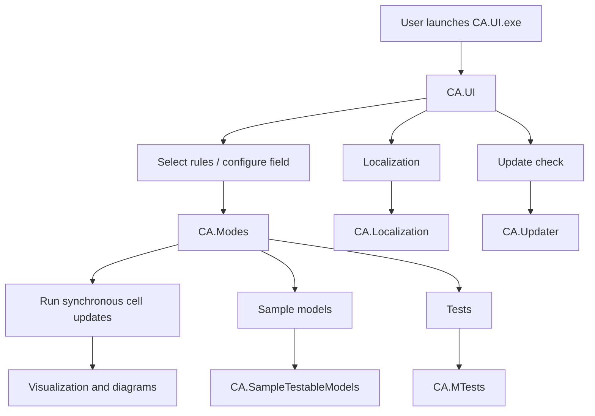
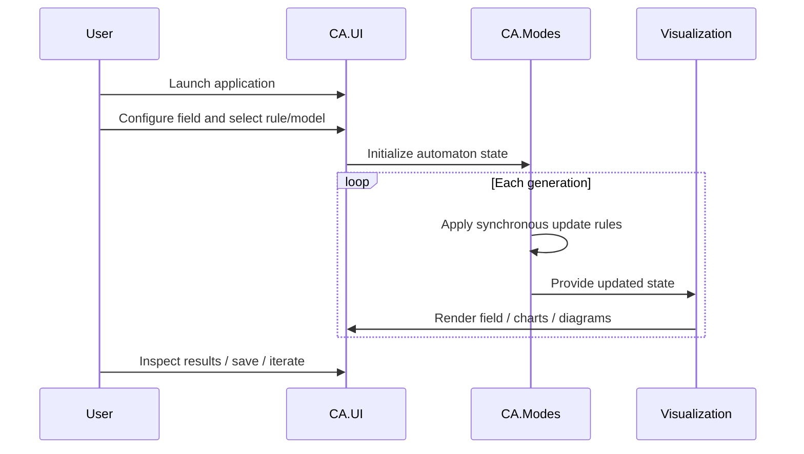

# camachineresearch

**Cellular automata machines for learning quantum physics**

`camachineresearch` is a C# desktop application and experiment framework for exploring how **cellular automata (CA)** can be used to study ideas inspired by **quantum physics** and **string theory**. The project combines a graphical user interface, a library of automata modes, sample testable models, localization support, tests, and an updater into a single research-oriented software package.

The repository presents cellular automata not merely as visual simulations, but as a **multi-matrix computational environment** for experimenting with discrete space, local interaction rules, wave-like propagation, diffusion-like behavior, and higher-dimensional abstractions.

> The project is designed to study different aspects of the quantum physics and string theory, using Cellular Automata Machine. Download zip, extract to new folder, run CA.UI.exe.

---

## Table of contents

- [Overview](#overview)
- [Why cellular automata for quantum-physics-inspired research](#why-cellular-automata-for-quantum-physics-inspired-research)
- [Core ideas](#core-ideas)
- [System architecture](#system-architecture)
- [Repository structure](#repository-structure)
- [Implemented modes and models](#implemented-modes-and-models)
- [How the software works](#how-the-software-works)
- [Typical workflow](#typical-workflow)
- [Getting started](#getting-started)
- [Build notes](#build-notes)
- [Research scope and limitations](#research-scope-and-limitations)
- [Who this project may be useful for](#who-this-project-may-be-useful-for)
- [License](#license)

---

## Overview

This software appears to be organized as a **Windows-based simulation environment** centered around the executable `CA.UI.exe`, which acts as the main entry point for running, configuring, and visualizing cellular automata experiments. Around that UI, the solution includes:

- **`CA.UI`** — the main desktop application for running experiments and interacting with the automata field.
- **`CA.Modes`** — the core collection of automata rules, behaviors, and simulation modes.
- **`CA.SampleTestableModels`** — example research models such as `HarmonicOscillator` and `TestReflectionModel`.
- **`CA.MTests`** — tests for validating model behavior.
- **`CA.Localization`** — localization/culture support.
- **`CA.DynamicModels`** — dynamic model-related functionality.
- **`CA.Updater`** — a companion updater application.
- **`CA.Setup`** — installer/setup project.

At a high level, the project provides a way to define a field, choose a mode, run discrete-time updates, and inspect the resulting emergent behavior through a GUI.

---

## Why cellular automata for quantum-physics-inspired research

The original README explains why the author considers CA machines useful for this kind of work. Those points are preserved below and rewritten for clarity while keeping the meaning intact.

There are several reasons why the Cellular Automata Machine is suitable for this purpose:

1. **Local interaction and finite information propagation**  
   Cellular Automata Machines approximate local interactions. Information spreads with limited speed from one neighborhood to another, which is conceptually comparable to finite propagation in the physical world. In that sense, the model aligns with ideas related to **causality** and the finite transmission of effects.

2. **Parallel multi-matrix representation**  
   A CA Machine can be constructed from an effectively unlimited number of parallel matrices. Each matrix can represent a separate dimension or store a distinct type of state, parameter, or real-time characteristic.

3. **Folded planes and toroidal topology**  
   Each matrix (plane) can be folded into a torus. In the project description, this is connected to the idea of **compactified dimensions** in theoretical physics, including references to **T-duality / T-compactification**. This makes it possible to operate with many dimensions while visualizing or focusing on selected ones.

4. **Discrete synchronous evolution over uniform space**  
   The state of the entire system changes simultaneously at discrete intervals. Within each matrix, space is uniform: rules apply consistently across the field, and no position is inherently special because of landscape or coordinate-specific behavior.

5. **Approximating diverse physical phenomena**  
   Through multi-matrix architecture and the main principles of CA Machines, the system aims to approximate physical phenomena of different kinds, including processes associated with quantum mechanics.

The original README also includes an important limitation that should remain explicit:

> Despite the conformity listed above, CA Machine doesn't allow to do exact measurements of a learning process, (until you do a real, live experiment and set a scale for the results obtained using CA Machine) it is only possible to sight the general tendencies and development of phenomenons of a learning process.

In other words, this software is best understood as a **research and intuition-building environment**, not a precise physical measurement system.

---

## Core ideas

### Conceptual model

The project can be understood as a layered CA engine:

```text
+--------------------------------------------------------------+
|                     Research / Interpretation                 |
|  Quantum-inspired behavior, wave-like evolution, dimensions  |
+--------------------------------------------------------------+
|                    Simulation Modes / Models                  |
|  Diffusion, wave sample, gas-like modes, reflection models   |
+--------------------------------------------------------------+
|                   Multi-matrix Cell State Space               |
|  Parallel planes store different properties of each cell      |
+--------------------------------------------------------------+
|                 Discrete Synchronous Time Steps               |
|  All cells evolve according to rules at each generation       |
+--------------------------------------------------------------+
|                         Visualization UI                      |
|  Field tuning, rule selection, diagrams, histograms           |
+--------------------------------------------------------------+
```

### Multi-matrix idea

A central concept in this repository is that one simulation is not limited to a single scalar grid. Instead, several matrices can work together, with each one representing a different aspect of state.

```text
              One logical cell position (x, y)

     +---------+   +---------+   +---------+   +---------+
     | Plane 0 |   | Plane 1 |   | Plane 2 |   | Plane N |
     | energy  |   | delta   |   | max val |   | custom  |
     +---------+   +---------+   +---------+   +---------+
           \             |             /             /
            \            |            /             /
             +-------------------------------------+
             | Combined update rule for next tick  |
             +-------------------------------------+
```

This kind of representation is particularly suitable for experiments where one wants to track multiple state variables per cell.

---

## System architecture



### Main runtime components

| Component | Purpose |
|---|---|
| `CA.UI` | Main Windows desktop application and entry point. |
| `CA.Modes` | Core automata rules and simulation behaviors. |
| `CA.SampleTestableModels` | Example models used for experimentation and testing. |
| `CA.MTests` | Automated tests for simulation/model logic. |
| `CA.Localization` | Culture and UI localization support. |
| `CA.DynamicModels` | Dynamic model support/extensions. |
| `CA.Updater` | Downloads and installs newer application versions. |
| `CA.Setup` | Installer/setup packaging. |

---

## Repository structure

| Path | Description |
|---|---|
| `README.md` | Project introduction and research rationale. |
| `CellularAutomata.sln` | Main Visual Studio solution tying all projects together. |
| `CA.UI/` | GUI application, forms, visualization helpers, rule selection, field tuning. |
| `CA.Modes/` | Implemented automata modes and interfaces. |
| `CA.SampleTestableModels/` | Example models such as harmonic oscillator and reflection experiments. |
| `CA.MTests/` | Test project. |
| `CA.Localization/` | Localization resources and culture management. |
| `CA.DynamicModels/` | Dynamic model project. |
| `CA.Updater/` | Standalone updater application. |
| `CA.Setup/` | Setup/installer project. |
| `LICENSE` | Project license. |

---

## Implemented modes and models

Based on the repository contents, the software includes a variety of built-in modes and model classes.

### Modes in `CA.Modes`

| Mode / File | Likely focus |
|---|---|
| `WaveSample.cs` | Wave-like propagation and activation behavior. |
| `Naiv_Deffusion.cs` | Diffusion-style evolution. |
| `Primitiv_Deffusion.cs` | Primitive/simple diffusion model. |
| `GM_GAS.cs` | Gas-style automata behavior. |
| `TM_GAS.cs` | Additional gas-related mode/variant. |
| `GreenbergEndGastings.cs` | Greenberg-Hastings style excitable-media dynamics. |
| `ParityFlip.cs` | Rule behavior involving parity/state flips. |
| `Time_Tunnel.cs` | Time- or propagation-related experiment mode. |
| `AntiWorm.cs` | Specialized custom automaton mode. |
| `BenksComp.cs` | Custom/experimental mode. |
| `Demographiya.cs` | Population/demography-inspired automaton. |
| `Dendrit.cs` | Dendrite-like growth or branching behavior. |
| `Gistogramma.cs` | Histogram/analysis-related behavior. |
| `Rac.cs` | Specialized custom mode. |
| `Silverman.cs` | Specialized custom mode. |

### Example models in `CA.SampleTestableModels`

| Model | Purpose |
|---|---|
| `HarmonicOscillator.cs` | Sample model inspired by oscillatory dynamics. |
| `TestReflectionModel.cs` | Example reflection/interaction test model. |

### Supporting interfaces and options

| File | Role |
|---|---|
| `ITestable.cs` | Contract for testable models/modes. |
| `IDiagramme.cs` | Contract for diagram/visual output integration. |
| `ILead.cs` | Shared interface/support type. |
| `UserOptions.cs` | User-configurable simulation options. |
| `VishnaksOptions.cs` | Additional configurable options. |

---

## How the software works

The project follows a fairly standard simulation loop, adapted to a multi-plane cellular automaton.



### Observed UI capabilities

From the repository structure, the UI likely includes support for:

- selecting rules and modes (`SelectRules`)
- tuning field parameters (`TuningOfTheField`)
- viewing diagrams (`Diagramme`)
- viewing histogram-related output (`Gistogramma1`)
- loading a saved model file via command-line/opening `.camodel` files
- startup update checks through `CA.Updater`
- localized UI culture handling

### Entry point behavior

The main application startup logic suggests the following:

- `CA.UI.exe` is the main executable.
- The app can accept a `.camodel` file as an argument.
- It tries to ensure a single-instance behavior and forwards model file information to an already-running instance when needed.
- On startup, it checks whether an update is available and may launch `CA.Updater.exe`.

---

## Typical workflow

```text
1. Download the packaged application
2. Extract it to a new folder
3. Run CA.UI.exe
4. Choose a simulation rule or model
5. Configure field parameters and options
6. Start the automaton
7. Observe field evolution, diagrams, and histograms
8. Iterate on rules and parameters to study emergent behavior
```

---

## Getting started

### Running a packaged build

The usage instruction preserved from the original README is straightforward:

1. Download the zip package.
2. Extract it to a new folder.
3. Run `CA.UI.exe`.

### Working from source

This repository is organized as a Visual Studio solution:

- Open `CellularAutomata.sln` in Visual Studio.
- Build the solution.
- Start the `CA.UI` project to launch the desktop application.

Because the codebase targets an older .NET/Visual Studio-era Windows desktop stack, you may need a compatible Windows development environment to build and run it successfully.

---

## Build notes

| Item | Notes |
|---|---|
| Language | Primarily C# with a small amount of C. |
| Solution file | `CellularAutomata.sln` |
| Main executable | `CA.UI.exe` |
| Updater executable | `CA.Updater.exe` |
| Application style | Windows desktop / GUI simulation tool |
| Packaging | Includes setup and updater projects |
| Testing | Includes `CA.MTests` and sample testable models |

---

## Research scope and limitations

This project should be interpreted as a **discrete simulation environment** for research, experimentation, and conceptual exploration.

### Strengths

- Good fit for studying **local interaction rules**.
- Natural support for **discrete time evolution**.
- Supports **layered/multi-plane state representations**.
- Useful for exploring **emergent behavior** from simple local rules.
- Suitable for educational, exploratory, and hypothesis-generating work.

### Limitations

- It is **not** a direct substitute for continuous physical measurement.
- Results should be treated as **qualitative or exploratory**, not automatically as exact physical predictions.
- Any correspondence to real physical systems depends on model design, calibration, and external validation.

---

## Who this project may be useful for

This repository may be especially interesting for:

- researchers exploring **discrete models of physical systems**
- students learning about **cellular automata and emergent behavior**
- developers building **simulation-heavy desktop applications**
- experimenters interested in **quantum-inspired computational models**
- anyone studying how **multi-dimensional state fields** can be represented in grid-based systems

---

## Key ideas at a glance

| Theme | How it appears in this project |
|---|---|
| Discrete space | Represented as cellular fields / matrices |
| Discrete time | Global synchronous step-by-step updates |
| Locality | Rules depend on nearby cells and adjacent state |
| Higher-dimensional abstraction | Multiple parallel matrices / planes |
| Compactification analogy | Toroidal folding of planes |
| Visualization | Diagrams, histograms, and GUI-based inspection |
| Experimentation | Multiple built-in modes and sample models |

---

## License

This repository includes a `LICENSE` file. See that file for the governing license terms.

---

## Summary

`camachineresearch` is a research-oriented cellular automata platform for experimenting with **multi-matrix discrete systems** inspired by **quantum physics**, **string theory**, and other complex phenomena. It combines simulation modes, sample models, visualization tools, testing, localization, installation, and updating into a single Windows desktop codebase.

Most importantly, the original project rationale remains central: the software is useful because cellular automata provide a way to study **local interaction, discrete evolution, uniform space, layered dimensions, and qualitative emergent behavior** in a compact and programmable form.
