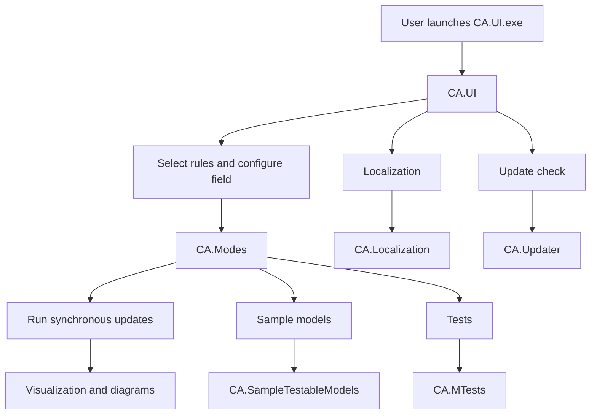
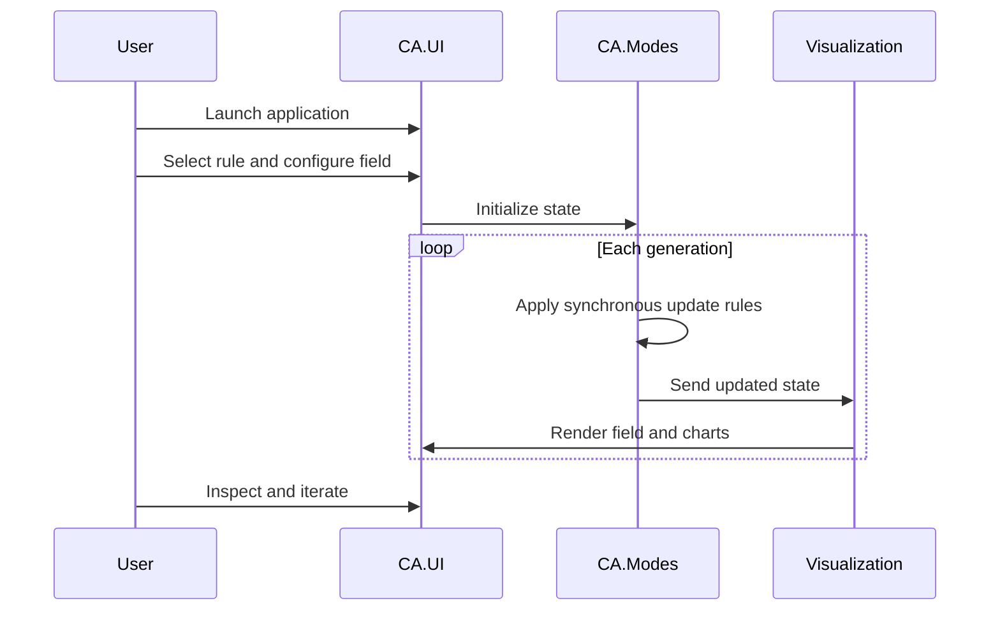

# camachineresearch

**Cellular automata machines for learning quantum physics**

A Windows desktop research tool for exploring **cellular automata**, **multi-matrix state spaces**, and **quantum-physics-inspired simulation ideas**.

`camachineresearch` combines a GUI, a library of automata modes, sample models, tests, localization support, and an updater into one experimental platform for studying discrete systems and emergent behavior.

> The project is designed to study different aspects of the quantum physics and string theory, using Cellular Automata Machine. Download zip, extract to new folder, run CA.UI.exe.

---

## Highlights

- **Research-oriented CA platform** for quantum-physics-inspired experimentation
- **Multi-matrix architecture** for representing multiple state variables per cell
- **Desktop GUI** for configuring fields, choosing rules, and visualizing results
- **Built-in modes and sample models** including wave, diffusion, gas, and oscillator-like experiments
- **Visualization support** through diagrams and histogram-style views
- **Updater, setup, tests, and localization** included in the solution

---

## Screenshots

> Existing repository assets are embedded below to make the project page more visual for public visitors.

### Main application / field view


### Menu / interface asset


### Additional interface asset


---

## What this project is

This repository presents cellular automata not only as visual simulations, but as a **multi-matrix computational environment** for experimenting with:

- discrete space
- local interaction rules
- synchronous time evolution
- wave-like and diffusion-like behavior
- higher-dimensional abstractions represented by parallel planes

At the center of the project is **`CA.UI.exe`**, the desktop application used to run and inspect experiments.

---

## Why cellular automata for quantum-physics-inspired research

The original README contains the main motivation for the project. Those points are preserved here in a clearer, more public-facing form.

There are several reasons why the Cellular Automata Machine is suitable for this purpose:

1. **Local interaction and finite propagation**  
   Cellular Automata Machines approximate local interactions, where information spreads step by step across neighboring cells. This makes them a natural conceptual fit for modeling causality and finite propagation.

2. **Parallel multi-matrix representation**  
   A CA Machine can be built from multiple parallel matrices. Each matrix can represent a separate dimension or a different type of state or real-time characteristic.

3. **Toroidal planes and compactification analogy**  
   Each matrix (plane) can be folded into a torus. In the original project rationale, this is related to ideas such as compactified dimensions and T-duality / T-compactification.

4. **Discrete synchronous evolution in uniform space**  
   The whole system evolves simultaneously in discrete time steps. Each matrix is uniform, meaning the same rules apply everywhere in the simulated space.

5. **Approximation of diverse physical phenomena**  
   The multi-matrix architecture and CA principles make it possible to approximate a range of physical-style processes, including phenomena associated with quantum mechanics.

The original README also makes an important limitation clear:

> Despite the conformity listed above, CA Machine doesn't allow to do exact measurements of a learning process, (until you do a real, live experiment and set a scale for the results obtained using CA Machine) it is only possible to sight the general tendencies and development of phenomenons of a learning process.

This is best understood as a **research and exploration environment**, not a precise physical measurement tool.

---

## Core idea

A central concept in this repository is the use of **multiple matrices (planes)** to represent the state of one simulation.

```text
              One logical cell position (x, y)

     +---------+   +---------+   +---------+   +---------+
     | Plane 0 |   | Plane 1 |   | Plane 2 |   | Plane N |
     | energy  |   | delta   |   | max val |   | custom  |
     +---------+   +---------+   +---------+   +---------+
           \             |             /             /
            \            |            /             /
             +-------------------------------------+
             | Combined update rule for next tick  |
             +-------------------------------------+
```

This allows the software to track several properties of each cell at once, which is useful for complex experimental models.

---

## Architecture



---

## Repository structure

| Path | Purpose |
|---|---|
| `CA.UI/` | Main desktop application, rule selection, field tuning, and visualization |
| `CA.Modes/` | Core automata rules and simulation modes |
| `CA.SampleTestableModels/` | Example models such as `HarmonicOscillator` and `TestReflectionModel` |
| `CA.MTests/` | Test project |
| `CA.Localization/` | Localization support |
| `CA.DynamicModels/` | Dynamic model functionality |
| `CA.Updater/` | Updater application |
| `CA.Setup/` | Installer/setup project |
| `CellularAutomata.sln` | Main Visual Studio solution |

---

## Included modes and models

### Modes in `CA.Modes`

| Mode / File | Likely focus |
|---|---|
| `WaveSample.cs` | Wave-like propagation and activation |
| `Naiv_Deffusion.cs` | Diffusion-style evolution |
| `Primitiv_Deffusion.cs` | Simple diffusion model |
| `GM_GAS.cs` | Gas-style automata behavior |
| `TM_GAS.cs` | Gas-related variant |
| `GreenbergEndGastings.cs` | Excitable-media dynamics |
| `ParityFlip.cs` | Parity/state flips |
| `Time_Tunnel.cs` | Time / propagation experiment |
| `AntiWorm.cs` | Specialized custom automaton |
| `BenksComp.cs` | Experimental mode |
| `Demographiya.cs` | Population-inspired automaton |
| `Dendrit.cs` | Dendrite-like growth behavior |
| `Gistogramma.cs` | Histogram / analysis-related behavior |
| `Rac.cs` | Specialized custom mode |
| `Silverman.cs` | Specialized custom mode |

### Sample models in `CA.SampleTestableModels`

| Model | Description |
|---|---|
| `HarmonicOscillator.cs` | Oscillator-inspired experimental model |
| `TestReflectionModel.cs` | Reflection/interaction test model |

---

## Typical workflow



---

## Getting started

### Run a packaged build

1. Download the zip package.
2. Extract it to a new folder.
3. Run `CA.UI.exe`.

### Run from source

1. Open `CellularAutomata.sln` in Visual Studio.
2. Build the solution.
3. Start the `CA.UI` project.

> This is an older Windows desktop codebase, so a compatible Visual Studio / .NET environment may be required.

---

## At a glance

| Theme | How it appears here |
|---|---|
| Discrete space | Cellular fields / matrices |
| Discrete time | Synchronous step-by-step updates |
| Locality | Rules depend on neighboring cells |
| Higher-dimensional abstraction | Multiple parallel matrices / planes |
| Visualization | GUI, diagrams, and histogram-style views |
| Experimentation | Multiple built-in modes and sample models |

---

## Limitations

- This is an **exploratory simulation environment**, not a precise physical measurement system.
- Results should be interpreted as **qualitative or experimental**, unless externally validated.
- Any mapping to real physical systems depends on model assumptions, calibration, and interpretation.

---

## License

This repository includes a `LICENSE` file. See that file for the governing license terms.
